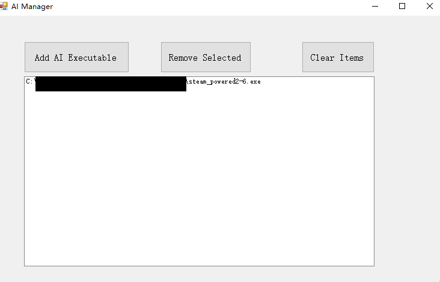
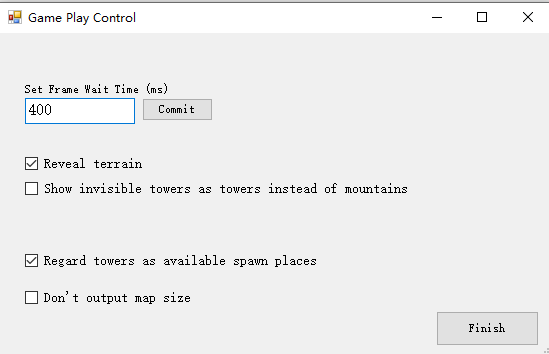
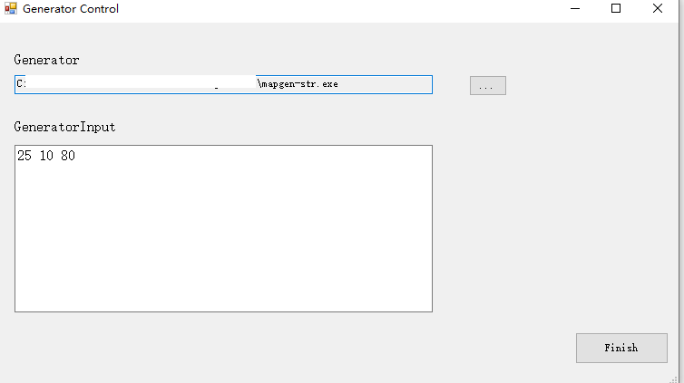

created by ynycoding

编译文件夹中的mapgen-str作为地图生成器
推荐每次都使用generator生成随机地图

将平台选项按照如下方式设置：
AI管理器（可以自己加入多个AI）：

游戏设置：

生成器配置：

点击player vs ai即可开始游戏
AI FFA为AI混战
都支持多AI

游戏规则为：tower每2s +1sodier  land每50s+1sodier